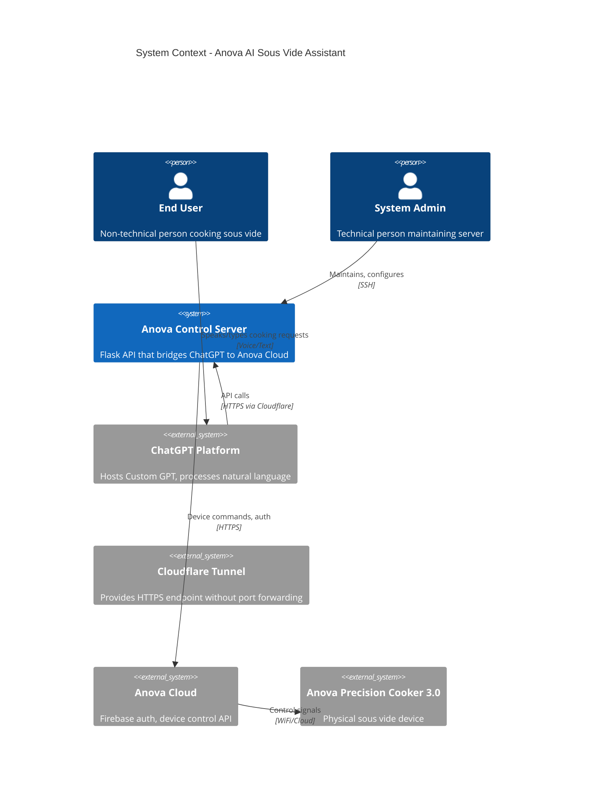

# 01 - System Context

> **Document Type:** C4 Level 1 - System Context  
> **Status:** Draft  
> **Version:** 2.0 (Merged)  
> **Last Updated:** 2025-01-08  
> **Depends On:** None (foundational document)  
> **Blocks:** 02-Security Architecture, 03-Component Architecture, 05-API Specification

---

## 1. Executive Summary

The Anova AI Sous Vide Assistant is a **bridge system** that enables natural language control of an Anova Precision Cooker 3.0 through ChatGPT. The system consists of a lightweight Python API server that translates ChatGPT Custom GPT actions into Anova cloud API commands while enforcing food safety constraints.

### Key Characteristics

| Attribute | Value |
|-----------|-------|
| **Architecture Style** | API Gateway / Bridge Pattern |
| **Deployment Model** | Self-hosted (Raspberry Pi Zero 2 W) |
| **Primary Interface** | ChatGPT Custom GPT |
| **Backend** | Python Flask REST API |
| **External Dependencies** | Anova Cloud API, Cloudflare Tunnel |
| **Critical Constraint** | Zero recurring costs, food safety validation |

---

## 2. System Context Diagram (C4 Level 1)

### 2.1 ASCII Diagram

```
                                    ┌─────────────────────────────────────┐
                                    │         EXTERNAL SYSTEMS            │
                                    └─────────────────────────────────────┘

    ┌──────────────────┐     ┌──────────────────┐     ┌──────────────────┐
    │   ChatGPT        │     │   Anova Cloud    │     │   Cloudflare     │
    │   Platform       │     │   (Firebase)     │     │   Tunnel         │
    │                  │     │                  │     │                  │
    │  • Custom GPT    │     │  • Device API    │     │  • HTTPS Proxy   │
    │  • OpenAI API    │     │  • Auth (JWT)    │     │  • DNS           │
    │  • Actions       │     │  • WebSocket     │     │  • TLS Cert      │
    └────────┬─────────┘     └────────┬─────────┘     └────────┬─────────┘
             │                        │                        │
             │ HTTPS                  │ HTTPS                  │ Tunnel
             │ (Actions)              │ (API Calls)            │ Protocol
             │                        │                        │
             ▼                        ▼                        ▼
    ╔════════════════════════════════════════════════════════════════════╗
    ║                     ANOVA ASSISTANT SYSTEM                         ║
    ║                        [WE BUILD THIS]                             ║
    ║                                                                    ║
    ║   ┌────────────────────────────────────────────────────────────┐   ║
    ║   │                    Control Server                          │   ║
    ║   │                                                            │   ║
    ║   │  • Validates cooking parameters (food safety critical)     │   ║
    ║   │  • Translates API calls to Anova commands                  │   ║
    ║   │  • Manages authentication with Anova Cloud                 │   ║
    ║   │  • Reports device status                                   │   ║
    ║   │                                                            │   ║
    ║   │  Location: Raspberry Pi Zero 2 W (prod) / Dev machine      │   ║
    ║   │  Exposure: HTTPS via Cloudflare Tunnel only                │   ║
    ║   └────────────────────────────────────────────────────────────┘   ║
    ╚════════════════════════════════════════════════════════════════════╝
             │
             │ WiFi (via Anova Cloud)
             ▼
    ┌──────────────────┐          ┌──────────────────┐
    │  Anova Precision │          │      USER        │
    │  Cooker 3.0      │◄─────────┤                  │
    │                  │ Physical │  • ChatGPT App   │
    │  • WiFi Module   │ Cooking  │  • Anova App     │
    │  • Temperature   │          │  • Voice/Text    │
    │  • Timer         │          └──────────────────┘
    └──────────────────┘
```

### 2.2 Mermaid Diagram



---

## 3. Actors & Stakeholders

### 3.1 Primary Actors

| Actor ID | Actor | Role | Technical Skill | Interaction Method |
|----------|-------|------|-----------------|-------------------|
| ACT-01 | End User (Recipient) | Cook sous vide | Non-technical | ChatGPT app (voice/text), Anova app (notifications) |
| ACT-02 | System Admin (Gift Giver) | System maintainer | Developer-level | SSH, direct server access |

### 3.2 Actor Profiles

#### ACT-01: End User (Recipient)

**Description:** The recipient of this system as a gift. They want to cook sous vide using natural conversation rather than navigating the Anova app. They may have limited knowledge of sous vide cooking techniques.

**Assumptions:**
- Already has ChatGPT Plus subscription
- Has iPhone/Android with ChatGPT app installed
- Has Anova app installed and device paired
- Located in Switzerland (timezone: CET/CEST)
- Speaks English (primary interaction language)

**Success Criteria:**
- Can start cooking without touching Anova app
- Receives helpful guidance on temperatures and times
- Never receives unsafe cooking recommendations
- Gets clear feedback when something goes wrong

**Failure Tolerance:** Low. If system fails, user can fall back to Anova app or physical buttons.

#### ACT-02: System Admin (Gift Giver)

**Description:** The person building and maintaining this system. Has full access to server, credentials, and codebase.

**Assumptions:**
- Comfortable with Python, Flask, Linux
- Can SSH into Raspberry Pi remotely
- Has access to recipient's Anova credentials (with permission)
- Available for occasional troubleshooting

**Success Criteria:**
- System runs for months without intervention
- Can diagnose issues remotely via logs
- Can update system without physical access to Pi

**Failure Tolerance:** Medium. Expects occasional maintenance but minimal.

### 3.3 External Systems

| System ID | System | Owner | Purpose | Dependency Level |
|-----------|--------|-------|---------|------------------|
| EXT-01 | ChatGPT Platform | OpenAI | Natural language interface | Critical |
| EXT-02 | Anova Cloud | Anova/Electrolux | Device control API | Critical |
| EXT-03 | Cloudflare Tunnel | Cloudflare | Public HTTPS endpoint | Critical |
| EXT-04 | Firebase Auth | Google (via Anova) | Authentication | Critical |

---

## 4. Trust Boundaries

### 4.1 Trust Boundary Diagram

```
┌─────────────────────────────────────────────────────────────────────────────┐
│                           TRUST BOUNDARIES                                  │
└─────────────────────────────────────────────────────────────────────────────┘

    UNTRUSTED                PARTIALLY TRUSTED           FULLY TRUSTED
    ──────────────────────────────────────────────────────────────────────────

    ┌─────────────┐
    │  End User   │
    │   Input     │
    └──────┬──────┘
           │
           │ Natural language (could contain anything)
           ▼
    ════════════════════════════════════════════════════════════════════════
    │              TRUST BOUNDARY 1 (TB-01): User → ChatGPT                 │
    ════════════════════════════════════════════════════════════════════════
           │
           ▼
    ┌─────────────────────────────────────────────┐
    │              ChatGPT Platform               │
    │                                             │
    │  - Interprets user intent                   │
    │  - Applies GPT safety guidelines            │
    │  - Structures API requests                  │
    │  - CANNOT see Anova credentials             │
    │  - CANNOT bypass API validation             │
    └──────────────────┬──────────────────────────┘
                       │
                       │ Structured API calls (JSON)
                       │ Could still contain invalid values
                       ▼
    ════════════════════════════════════════════════════════════════════════
    │            TRUST BOUNDARY 2 (TB-02): ChatGPT → Server                 │
    ════════════════════════════════════════════════════════════════════════
                       │
                       ▼
    ┌─────────────────────────────────────────────┐
    │           Anova Control Server              │
    │           [FULLY TRUSTED ZONE]              │
    │                                             │
    │  - Validates ALL inputs                     │
    │  - Enforces food safety rules               │
    │  - Holds Anova credentials                  │
    │  - Manages authentication tokens            │
    │  - Logs all operations                      │
    └──────────────────┬──────────────────────────┘
                       │
                       │ Authenticated API calls
                       ▼
    ════════════════════════════════════════════════════════════════════════
    │            TRUST BOUNDARY 3 (TB-03): Server → Anova Cloud             │
    ════════════════════════════════════════════════════════════════════════
                       │
                       ▼
    ┌─────────────────────────────────────────────┐
    │              Anova Cloud                    │
    │              [TRUSTED API]                  │
    └─────────────────────────────────────────────┘
```

### 4.2 Trust Boundary Rules

| Boundary ID | Boundary | Rule | Enforcement |
|-------------|----------|------|-------------|
| TB-01 | User → ChatGPT | User input is untrusted | ChatGPT's built-in safety; our GPT instructions |
| TB-02 | ChatGPT → Server | API requests are partially trusted | Server validates ALL parameters; rejects unsafe values |
| TB-03 | Server → Anova | Server is trusted; Anova validates further | Credentials stored securely; HTTPS only |

### 4.3 Critical Security Invariants

| Invariant ID | Invariant | Rationale |
|--------------|-----------|-----------|
| SEC-INV-01 | Anova credentials (email/password) never leave the local server | Prevents account compromise |
| SEC-INV-02 | Credentials are never logged, even in debug mode | Prevents credential leakage via logs |
| SEC-INV-03 | ChatGPT never receives credentials or tokens | GPT is not trusted with secrets |
| SEC-INV-04 | All API inputs are validated server-side | ChatGPT could hallucinate or be prompt-injected |
| SEC-INV-05 | Food safety rules are enforced at server, not just GPT | Defense in depth |

---

## 5. System Boundaries

### 5.1 In Scope

| Scope ID | Capability | Description | Priority |
|----------|------------|-------------|----------|
| SCOPE-01 | Cook initiation | Start cooking with temperature and time parameters | P0 |
| SCOPE-02 | Cook monitoring | Query current status (temp, time remaining, state) | P0 |
| SCOPE-03 | Cook termination | Stop active cooking session | P0 |
| SCOPE-04 | Natural language interface | Conversational interaction via ChatGPT | P0 |
| SCOPE-05 | Food safety validation | Temperature/time validation per food type | P0 |
| SCOPE-06 | Food safety guidance | Temperature/time recommendations per food type | P1 |

### 5.2 Out of Scope (Phase 1)

| OOS ID | Capability | Rationale | Alternative |
|--------|------------|-----------|-------------|
| OOS-01 | Recipe database | Future enhancement, not MVP | GPT's built-in knowledge |
| OOS-02 | Multi-device support | Single device simplifies initial deployment | Future enhancement |
| OOS-03 | Custom notifications | Complexity vs. value tradeoff | Anova app provides this natively |
| OOS-04 | Scheduling/delayed start | Food safety issues with delayed start | Not implemented |
| OOS-05 | Analytics/history | Privacy concern; not required for core | Not implemented |
| OOS-06 | Real-time streaming | Adds complexity; polling sufficient | Polling on status requests |

---

## 6. Functional Requirements

### 6.1 Core Functions

| Req ID | Requirement | Priority | Acceptance Criteria |
|--------|-------------|----------|---------------------|
| FR-01 | System SHALL start a cooking session with specified temperature and duration | Must | Given valid parameters, when start-cook is called, then device begins heating within 30 seconds |
| FR-02 | System SHALL report current cooking status | Must | Given an active session, when status is queried, then response includes current_temp, target_temp, time_remaining, state |
| FR-03 | System SHALL stop an active cooking session | Must | Given an active session, when stop-cook is called, then device stops heating within 10 seconds |
| FR-04 | System SHALL validate temperature is within safe range (40-100°C) | Must | Given temperature outside range, when start-cook is called, then request is rejected with error |
| FR-05 | System SHALL validate time is positive integer (1-5999 minutes) | Must | Given invalid time, when start-cook is called, then request is rejected with error |
| FR-06 | System SHALL return device offline status when device unreachable | Must | Given device offline, when any command is sent, then response indicates offline state |
| FR-07 | System SHALL reject unsafe poultry temperatures (<57°C) | Must | Given poultry food_type and temp < 57°C, then request is rejected with safety explanation |
| FR-08 | System SHALL reject unsafe ground meat temperatures (<60°C) | Must | Given ground meat food_type and temp < 60°C, then request is rejected with safety explanation |

### 6.2 ChatGPT Integration Functions

| Req ID | Requirement | Priority | Acceptance Criteria |
|--------|-------------|----------|---------------------|
| FR-10 | Custom GPT SHALL interpret natural language cooking requests | Must | Given "cook chicken breast", GPT extracts food_type=chicken, suggests temp=65°C, time=90min |
| FR-11 | Custom GPT SHALL confirm before starting cook | Should | Given a cook request, GPT presents parameters and asks for confirmation before calling API |
| FR-12 | Custom GPT SHALL provide food safety guidance | Must | Given unsafe parameters requested, GPT warns user and suggests safe alternatives |
| FR-13 | Custom GPT SHALL handle ambiguous requests with clarifying questions | Should | Given "cook steak", GPT asks about thickness and desired doneness |

---

## 7. Quality Requirements

This section defines measurable quality attributes with explicit acceptance criteria. Each requirement includes target thresholds, test methods, copy-pasteable commands, and pass/fail criteria.

### 7.1 Performance

#### QR-01: API Response Time (p50) < 1 Second

**Requirement:** The API SHALL respond to requests with p50 latency under 1 second under normal load.

**Target:** p50 response time < 1000ms

**Test Method:**
- **Tool:** Apache Bench (ab) v2.3+
- **Command:**
  ```bash
  ab -n 100 -c 10 -H "Authorization: Bearer $API_KEY" \
     http://localhost:5000/health
  ```
- **Test Scenario:**
  - 100 total requests
  - 10 concurrent connections
  - Warm-up: 20 requests (discarded from analysis)
  - Measurement: Next 80 requests (p50 calculated)
  - Server state: Idle (no active cooking session)

**Pass Criteria:**
- ✅ p50 response time < 1000ms (measured over 5 consecutive test runs)
- ✅ All 5 test runs must meet threshold
- ✅ No test run exceeds 1100ms (10% tolerance for variability)
- ✅ Standard deviation < 200ms across 5 runs (consistency check)

**Traceability:**
- **Test Cases:** INT-PERF-02, Need: PERF-01
- **Implementation Status:** 🟡 Partial spec - needs formal PERF-01 test
- **Related Requirements:** QR-02, QR-03, QR-04

**Rationale:** Fast API response ensures good ChatGPT Actions experience (30s timeout constraint). p50 represents typical user experience.

---

#### QR-02: API Response Time (p95) < 2 Seconds

**Requirement:** The API SHALL respond to requests with p95 latency under 2 seconds under normal load.

**Target:** p95 response time < 2000ms

**Test Method:**
- **Tool:** Apache Bench (ab) v2.3+ or Locust
- **Command:**
  ```bash
  ab -n 200 -c 20 -H "Authorization: Bearer $API_KEY" \
     http://localhost:5000/status
  ```
- **Test Scenario:**
  - 200 total requests
  - 20 concurrent connections (higher stress than QR-01)
  - Warm-up: 40 requests (discarded)
  - Measurement: Next 160 requests (p95 calculated)
  - Server state: Active cooking session (realistic load)

**Pass Criteria:**
- ✅ p95 response time < 2000ms (measured over 5 consecutive test runs)
- ✅ At least 4 of 5 test runs must meet threshold (allowing 1 outlier)
- ✅ No test run exceeds 2200ms (10% tolerance)
- ✅ p50 remains under 1000ms (verify QR-01 holds under higher load)

**Traceability:**
- **Test Cases:** Need: PERF-01
- **Implementation Status:** ❌ Needs spec
- **Related Requirements:** QR-01, QR-03, QR-04

**Rationale:** p95 captures tail latency under moderate stress. Important for user satisfaction during concurrent requests.

---

#### QR-03: API Response Time (p99) < 5 Seconds

**Requirement:** The API SHALL respond to requests with p99 latency under 5 seconds under normal load.

**Target:** p99 response time < 5000ms

**Test Method:**
- **Tool:** Apache Bench (ab) v2.3+ or Locust
- **Command:**
  ```bash
  # Create payload file first
  echo '{"temperature_celsius": 65.0, "time_minutes": 90, "food_type": "chicken"}' > payload.json

  # Run load test
  ab -n 500 -c 50 -H "Authorization: Bearer $API_KEY" \
     -p payload.json -T application/json \
     http://localhost:5000/start-cook
  ```
- **Test Scenario:**
  - 500 total requests
  - 50 concurrent connections (stress test)
  - Warm-up: 100 requests (discarded)
  - Measurement: Next 400 requests (p99 calculated)
  - Server state: Mix of start-cook and status requests

**Pass Criteria:**
- ✅ p99 response time < 5000ms (measured over 3 consecutive test runs)
- ✅ At least 2 of 3 test runs must meet threshold
- ✅ No test run exceeds 5500ms (10% tolerance)
- ✅ No requests timeout (all complete within 30s)

**Traceability:**
- **Test Cases:** Need: PERF-01
- **Implementation Status:** ❌ Needs spec
- **Related Requirements:** QR-01, QR-02, QR-04

**Rationale:** p99 captures worst-case latency under stress. 5 second threshold ensures all requests complete well within ChatGPT's 30-second timeout.

---

#### QR-04: End-to-End Latency (ChatGPT → Device) < 5 Seconds

**Requirement:** The system SHALL complete a full action cycle (ChatGPT request → device state change) within 5 seconds.

**Target:** End-to-end latency < 5000ms

**Test Method:**
- **Tool:** Custom Python script + timestamp comparison
- **Script Location:** `tests/performance/test_e2e_latency.py` (to be created)
- **Command:**
  ```bash
  # Run end-to-end latency test
  pytest tests/performance/test_e2e_latency.py -v
  ```
- **Test Scenario:**
  1. Invoke Custom GPT action via ChatGPT API
  2. Record timestamp T1 (action invoked)
  3. Poll device status every 500ms
  4. Record timestamp T2 (device state = "cooking")
  5. Calculate latency = T2 - T1

**Pass Criteria:**
- ✅ Average latency < 5000ms (measured over 10 test runs)
- ✅ At least 9 of 10 runs must complete within 5 seconds
- ✅ Maximum latency < 7000ms (worst case)
- ✅ 95% of runs complete within 6 seconds

**Traceability:**
- **Test Cases:** INT-01 (informal)
- **Implementation Status:** 🟡 Needs formal test specification
- **Related Requirements:** QR-01, QR-02, QR-03

**Rationale:** End-to-end latency is the user-perceived delay. 5 seconds provides responsive experience while staying within ChatGPT's timeout.

---

#### QR-05: Server Memory Usage < 128 MB

**Requirement:** The server SHALL consume less than 128 MB of RAM during normal operation on Raspberry Pi Zero 2 W.

**Target:** Resident Set Size (RSS) < 128 MB

**Test Method:**
- **Tool:** `ps` and `/proc/[pid]/status`
- **Command:**
  ```bash
  # Get memory usage of anova-server process
  ps aux | grep anova-server | awk '{print $6}'  # RSS in KB

  # Or read from /proc
  cat /proc/$(pidof anova-server)/status | grep VmRSS

  # Continuous monitoring (1 hour)
  for i in {1..360}; do
    ps aux | grep anova-server | awk '{print $6}' >> memory_usage.log
    sleep 10
  done

  # Calculate max memory usage
  sort -n memory_usage.log | tail -1
  ```
- **Test Scenario:**
  - Measure after 1 hour of operation (idle)
  - Measure again after 10 start-cook + status + stop-cook cycles
  - Measure after 24 hours of operation (memory leak check)

**Pass Criteria:**
- ✅ Idle RSS < 64 MB (50% headroom)
- ✅ Active RSS < 128 MB (during cooking)
- ✅ 24-hour RSS < 128 MB (no memory leaks)
- ✅ No OOM kills in 1-week continuous operation

**Traceability:**
- **Test Cases:** Need: PERF-02
- **Implementation Status:** ❌ Needs spec
- **Related Requirements:** QR-06

**Rationale:** Raspberry Pi Zero 2 W has 512 MB RAM total. Must leave headroom for OS and other processes (~300-400 MB).

---

#### QR-06: Server CPU Usage (Idle) < 5%

**Requirement:** The server SHALL consume less than 5% CPU when idle on Raspberry Pi Zero 2 W.

**Target:** Average CPU usage < 5% (idle state)

**Test Method:**
- **Tool:** `top` or `pidstat`
- **Command:**
  ```bash
  # Continuous monitoring (1 hour)
  pidstat -p $(pidof anova-server) 1 3600 | awk '{print $8}' > cpu_usage.log

  # Calculate average (excluding header)
  tail -n +4 cpu_usage.log | awk '{sum+=$1; count++} END {print "Average:", sum/count "%"}'

  # Calculate 99th percentile
  tail -n +4 cpu_usage.log | sort -n | awk 'BEGIN{c=0} {val[c++]=$1} END{print "p99:", val[int(c*0.99)]}'
  ```
- **Test Scenario:**
  - Monitor for 1 hour
  - No active cooking session
  - No API requests (true idle)
  - Cloudflare tunnel active (realistic baseline)

**Pass Criteria:**
- ✅ Average CPU usage < 5% over 1-hour idle period
- ✅ No sustained spikes > 10% (lasting > 5 seconds)
- ✅ 99th percentile CPU usage < 15%
- ✅ Server responsive to requests within 500ms after idle period

**Traceability:**
- **Test Cases:** Need: PERF-02
- **Implementation Status:** ❌ Needs spec
- **Related Requirements:** QR-05

**Rationale:** Raspberry Pi Zero 2 W has limited CPU (1 GHz quad-core). Low idle usage ensures responsiveness and reduces power consumption.

---

**Performance Testing Guidance:**
- Use `docs/10-performance-test-specification.md` (when created) for detailed test procedures
- Run tests on Raspberry Pi Zero 2 W (production hardware) for accurate results
- Performance tests are **acceptance tests** (run before deployment, not in CI/CD)
- Failures indicate need for optimization, not blocking bugs

---

### 7.2 Reliability

#### QR-10: System Uptime 99% Monthly

**Requirement:** The system SHALL maintain 99% uptime over a 30-day period.

**Target:** Uptime ≥ 99.0% (maximum downtime: 7 hours 12 minutes per month)

**Test Method:**
- **Tool:** UptimeRobot (free tier) or custom monitoring
- **Command:**
  ```bash
  # If using custom monitoring (cron job every 5 minutes)
  # Add to crontab:
  */5 * * * * curl -f https://anova-server/health || echo "$(date) DOWN" >> /var/log/uptime.log

  # Calculate uptime after 30 days
  total_checks=$(wc -l < /var/log/uptime.log)
  down_checks=$(grep -c "DOWN" /var/log/uptime.log)
  uptime=$(echo "scale=2; (1 - $down_checks/$total_checks) * 100" | bc)
  echo "Uptime: $uptime%"
  ```
- **Test Scenario:**
  - Monitor `/health` endpoint every 5 minutes
  - Record all failures (HTTP error or timeout > 10s)
  - Exclude planned maintenance windows (< 1 hour/month)

**Pass Criteria:**
- ✅ Uptime ≥ 99.0% over rolling 30-day window
- ✅ No single outage > 2 hours (excluding power outages)
- ✅ Health check succeeds on first attempt after auto-recovery
- ✅ Planned maintenance < 1 hour/month (counted as uptime)

**Traceability:**
- **Test Cases:** Need: DEPLOY-01
- **Implementation Status:** ❌ Needs spec
- **Related Requirements:** QR-11, QR-12

**Rationale:** 99% uptime allows for occasional reboots and maintenance while ensuring reliable service. Balances reliability with maintenance needs.

---

#### QR-11: Auto-Recovery from Crash < 60 Seconds

**Requirement:** The system SHALL automatically restart within 60 seconds after a process crash.

**Target:** Time from crash to first successful health check < 60 seconds

**Test Method:**
- **Tool:** systemd + bash script
- **Command:**
  ```bash
  #!/bin/bash
  # Test auto-recovery from crash

  for run in {1..5}; do
    echo "Run $run of 5..."

    # Kill the process to simulate crash
    sudo kill -9 $(pidof anova-server)

    # Measure time to recovery
    start_time=$(date +%s)
    while ! curl -f http://localhost:5000/health >/dev/null 2>&1; do
      sleep 1
    done
    end_time=$(date +%s)
    recovery_time=$((end_time - start_time))

    echo "Recovery time: $recovery_time seconds"

    # Wait 10 seconds before next test
    sleep 10
  done
  ```
- **Test Scenario:**
  - systemd service configured with `Restart=always`
  - Kill process with SIGKILL (worst-case crash)
  - Measure time until health check succeeds
  - Repeat 5 times to verify consistency

**Pass Criteria:**
- ✅ Average recovery time < 60 seconds (across 5 test runs)
- ✅ All 5 runs complete recovery within 90 seconds (worst case)
- ✅ Health endpoint returns 200 OK after recovery
- ✅ Server logs show graceful restart (no corruption)

**Traceability:**
- **Test Cases:** Need: DEPLOY-02
- **Implementation Status:** ❌ Needs spec
- **Related Requirements:** QR-10, QR-12

**Rationale:** Fast auto-recovery minimizes service disruption. 60 seconds is acceptable downtime for non-critical home automation.

---

#### QR-12: Auto-Recovery from Power Cycle < 120 Seconds

**Requirement:** The system SHALL automatically start and become operational within 120 seconds after a power cycle.

**Target:** Time from power on to first successful API call < 120 seconds

**Test Method:**
- **Tool:** Smart plug + bash script (or manual power cycle)
- **Command:**
  ```bash
  #!/bin/bash
  # Test boot time after power cycle
  # NOTE: Run this script from external machine, not the Pi

  for run in {1..3}; do
    echo "Run $run of 3..."

    # Power off Pi (via smart plug API or manually)
    echo "Power off Pi now..."
    read -p "Press ENTER when powered off"

    # Wait 10 seconds
    sleep 10

    # Power on Pi
    echo "Power on Pi now..."
    read -p "Press ENTER when powered on"

    # Measure time to first successful API call
    start_time=$(date +%s)
    while ! curl -f https://anova-server.example.com/health >/dev/null 2>&1; do
      sleep 5
    done
    end_time=$(date +%s)
    boot_time=$((end_time - start_time))

    echo "Boot time: $boot_time seconds"
    echo ""
  done
  ```
- **Test Scenario:**
  - Full power cycle (unplug/replug power)
  - Pi boots from cold start
  - Cloudflare tunnel establishes connection
  - Server starts via systemd
  - Health check succeeds from external network

**Pass Criteria:**
- ✅ Average boot time < 120 seconds (across 3 test runs)
- ✅ All 3 runs complete within 150 seconds (worst case)
- ✅ Health endpoint accessible via public URL
- ✅ Cloudflare tunnel connection established
- ✅ Server logs show clean boot sequence

**Traceability:**
- **Test Cases:** Need: DEPLOY-03
- **Implementation Status:** ❌ Needs spec
- **Related Requirements:** QR-10, QR-11

**Rationale:** Power outages are common. Fast recovery ensures minimal service disruption. 120 seconds accounts for Pi boot time (~45s) + service startup (~30s) + tunnel establishment (~30s).

---

#### QR-13: Graceful Handling of Anova Cloud Outage

**Requirement:** The system SHALL gracefully handle Anova Cloud API outages without crashing.

**Target:** Server returns error responses (not crash) when Anova Cloud is unreachable

**Test Method:**
- **Tool:** Network simulation + curl
- **Command:**
  ```bash
  #!/bin/bash
  # Test graceful handling of Anova Cloud outage

  # Block Anova Cloud API via firewall
  sudo iptables -A OUTPUT -d anovaculinary.io -j DROP
  sudo iptables -A OUTPUT -d identitytoolkit.googleapis.com -j DROP

  # Test start-cook endpoint
  echo "Testing start-cook with Anova Cloud blocked..."
  response=$(curl -s -w "\n%{http_code}" -X POST https://anova-server/start-cook \
       -H "Authorization: Bearer $API_KEY" \
       -H "Content-Type: application/json" \
       -d '{"temperature_celsius": 65, "time_minutes": 90}')
  http_code=$(echo "$response" | tail -1)
  echo "HTTP Code: $http_code (expected: 503)"

  # Verify server still running
  echo "Testing health endpoint..."
  curl -f https://anova-server/health
  health_status=$?
  echo "Health check status: $health_status (expected: 0)"

  # Restore network
  sudo iptables -F

  # Verify operations resume
  echo "Testing start-cook after network restored..."
  curl -f -X POST https://anova-server/start-cook \
       -H "Authorization: Bearer $API_KEY" \
       -H "Content-Type: application/json" \
       -d '{"temperature_celsius": 65, "time_minutes": 90}'
  echo "Status: $? (expected: 0)"
  ```
- **Test Scenario:**
  - Block outbound traffic to Anova Cloud
  - Attempt start-cook, status, and stop-cook operations
  - Verify server responds with 503 Service Unavailable
  - Verify server process remains running
  - Restore network and verify operations resume

**Pass Criteria:**
- ✅ All API calls return HTTP 503 (not 500 or crash)
- ✅ Error responses include actionable message (e.g., "Device offline")
- ✅ Health endpoint continues to return 200 OK
- ✅ Server process remains running (no restart required)
- ✅ Operations resume automatically when network restored

**Traceability:**
- **Test Cases:** INT-03, INT-ERR-02, INT-07
- **Implementation Status:** ✅ Fully tested
- **Related Requirements:** QR-10

**Rationale:** Anova Cloud outages should not crash the server. Graceful degradation provides better user experience than complete failure.

---

**Reliability Testing Guidance:**
- QR-10, QR-11, QR-12 are **deployment tests** (run on production hardware, not in CI/CD)
- Use `docs/12-deployment-test-specification.md` (when created) for detailed procedures
- QR-13 is an **integration test** (run in CI/CD with mocked Anova API)

---

### 7.3 Maintainability

#### QR-20: Zero-Touch Operation for 3+ Months

**Requirement:** The system SHALL operate without manual intervention for at least 3 consecutive months.

**Target:** Zero manual interventions in 90-day period (excluding planned updates)

**Test Method:**
- **Tool:** Manual observation + intervention log
- **Command:**
  ```bash
  # Create intervention log
  sudo touch /var/log/interventions.log
  sudo chmod 664 /var/log/interventions.log

  # Log intervention (when manual action required)
  echo "$(date '+%Y-%m-%d %H:%M:%S'),REASON,ACTION_TAKEN" | sudo tee -a /var/log/interventions.log

  # Example interventions to log:
  # - Service restart (unplanned)
  # - Credential refresh (manual)
  # - Disk space cleanup
  # - Config change

  # Review interventions after 90 days
  echo "Unplanned interventions in last 90 days:"
  grep -v "PLANNED_UPDATE" /var/log/interventions.log | grep -v "^#"

  # Count unplanned interventions
  intervention_count=$(grep -v "PLANNED_UPDATE" /var/log/interventions.log | grep -v "^#" | wc -l)
  echo "Total unplanned interventions: $intervention_count (expected: 0)"
  ```
- **Test Scenario:**
  - Deploy system to production
  - Monitor for 90 days
  - Log all manual interventions (excluding planned updates)
  - Track intervention reasons (crash, disk full, credentials expired, etc.)

**Pass Criteria:**
- ✅ Zero unplanned interventions in 90-day period
- ✅ Planned updates < 2 per quarter (< 30 minutes each)
- ✅ No disk space issues (logs rotate properly)
- ✅ No credential expiration requiring manual refresh
- ✅ No service restarts required (other than updates)

**Traceability:**
- **Test Cases:** Need: DEPLOY-04
- **Implementation Status:** ❌ Manual tracking required
- **Related Requirements:** QR-21, QR-22

**Rationale:** Gift recipient expects appliance-like reliability. Zero-touch operation ensures system doesn't become a burden.

---

#### QR-21: Log Rotation (Logs < 100 MB Total)

**Requirement:** The system SHALL rotate logs to prevent disk space exhaustion, keeping total log size under 100 MB.

**Target:** Total log size < 100 MB on 16 GB SD card

**Test Method:**
- **Tool:** `du` + logrotate configuration
- **Command:**
  ```bash
  # Check total log size
  du -sh /var/log/anova-server
  du -b /var/log/anova-server | awk '{print $1}'  # Size in bytes

  # Verify logrotate configuration
  cat /etc/logrotate.d/anova-server
  # Should show: rotate 7, daily, compress, maxsize 100M

  # Test logrotate configuration
  sudo logrotate -d /etc/logrotate.d/anova-server  # Dry run

  # Force rotation and verify
  sudo logrotate -f /etc/logrotate.d/anova-server

  # Check size after rotation
  du -sh /var/log/anova-server

  # List log files (should see compressed .gz files)
  ls -lh /var/log/anova-server/
  ```

  **Example logrotate config (`/etc/logrotate.d/anova-server`):**
  ```
  /var/log/anova-server/*.log {
      daily
      rotate 7
      compress
      delaycompress
      missingok
      notifempty
      maxsize 15M
      create 0644 anova-server anova-server
      postrotate
          systemctl reload anova-server >/dev/null 2>&1 || true
      endscript
  }
  ```
- **Test Scenario:**
  - Configure logrotate for daily rotation
  - Keep 7 days of compressed logs
  - Maximum 15 MB per log file
  - Measure log size after 30 days of operation
  - Simulate high-traffic period (1000 requests/day)

**Pass Criteria:**
- ✅ Total log size < 100 MB after 30 days
- ✅ Logs rotate daily (7 files maximum)
- ✅ Old logs compressed (gzip)
- ✅ No log file exceeds 15 MB uncompressed
- ✅ Logs readable and parseable after rotation

**Traceability:**
- **Test Cases:** Need: DEPLOY-05
- **Implementation Status:** ❌ Needs spec
- **Related Requirements:** QR-20

**Rationale:** 16 GB SD card has limited space (~14 GB usable). 100 MB allows ~0.7% for logs with ample headroom for OS and application.

---

#### QR-22: Remote Administration (All Admin via SSH)

**Requirement:** The system SHALL support all administrative tasks via SSH without requiring physical access to Raspberry Pi.

**Target:** 100% of administrative tasks performable remotely

**Test Method:**
- **Tool:** Manual verification + admin task checklist
- **Command:**
  ```bash
  #!/bin/bash
  # Test all admin operations via SSH
  # Run this from remote machine (not local network)

  echo "Testing remote administration capabilities..."

  # Test SSH connection
  echo "1. Testing SSH connection..."
  ssh pi@anova-server.local "echo 'SSH connection successful'"

  # Test service status check
  echo "2. Testing service status check..."
  ssh pi@anova-server.local "systemctl status anova-server"

  # Test log viewing
  echo "3. Testing log viewing..."
  ssh pi@anova-server.local "journalctl -u anova-server -n 50"

  # Test configuration view (not credentials)
  echo "4. Testing configuration view..."
  ssh pi@anova-server.local "cat /opt/anova-server/config.ini"

  # Test service restart
  echo "5. Testing service restart..."
  ssh pi@anova-server.local "sudo systemctl restart anova-server"
  sleep 5
  ssh pi@anova-server.local "curl -f http://localhost:5000/health"

  # Test code update
  echo "6. Testing code update..."
  ssh pi@anova-server.local "cd /opt/anova-server && git fetch --dry-run"

  # Test resource monitoring
  echo "7. Testing resource monitoring..."
  ssh pi@anova-server.local "free -h && df -h && top -bn1 | head -20"

  echo "All remote admin tasks completed successfully"
  ```
- **Test Scenario:**
  - Perform all operations in checklist via SSH
  - No physical access to Pi during test
  - Test from remote location (not local network)
  - Verify operations complete successfully

**Pass Criteria:**
- ✅ All admin tasks in checklist completable via SSH
- ✅ SSH accessible from remote location (not just LAN)
- ✅ No operations require GUI or physical access
- ✅ Logs viewable via `journalctl` or file access
- ✅ Configuration updates possible without physical access
- ✅ Code updates and service restarts work remotely

**Admin Task Checklist:**
1. View service status
2. View logs (last 100 lines)
3. Restart service
4. Update credentials (via encrypted config file)
5. Update code (git pull)
6. Reboot system
7. Monitor resource usage (CPU, memory, disk)

**Traceability:**
- **Test Cases:** Need: DEPLOY-06
- **Implementation Status:** ❌ Needs spec
- **Related Requirements:** QR-20

**Rationale:** Gift recipient lives remotely. Physical access for maintenance is impractical. All admin tasks must be remote.

---

**Maintainability Testing Guidance:**
- QR-20 is a **long-term operational metric** (track post-launch, not testable pre-launch)
- QR-21, QR-22 are **deployment verification tests** (one-time checks during deployment)
- Use deployment checklist to verify QR-22

---

### 7.4 Security

#### QR-30: Credentials Isolation (Never in API Responses)

**Requirement:** The system SHALL never expose Anova credentials or tokens in API responses, logs, or error messages.

**Target:** Zero credential exposures

**Test Method:**
- **Tool:** Manual code review + API response inspection + log analysis
- **Command:**
  ```bash
  #!/bin/bash
  # Test credential isolation

  # 1. Code review: Search for credential logging
  echo "1. Checking for credential logging in code..."
  rg -i "password|token|api_key" server/ --type py | grep -i "log\|print"
  if [ $? -eq 0 ]; then
    echo "WARNING: Found potential credential logging"
  else
    echo "PASS: No credential logging found"
  fi

  # 2. API response inspection: Test all endpoints
  echo "2. Testing API responses for credential leakage..."
  for endpoint in /health /status /start-cook /stop-cook; do
    echo "Testing $endpoint..."
    response=$(curl -s https://anova-server$endpoint \
         -H "Authorization: Bearer $API_KEY" \
         -H "Content-Type: application/json" \
         -d '{"temperature_celsius": 65, "time_minutes": 90}')

    # Check for credentials in response
    echo "$response" | grep -iE "password|anova_password|ANOVA_EMAIL|firebase.*token" && \
      echo "FAIL: Credentials found in response" || \
      echo "PASS: No credentials in response"
  done

  # 3. Log analysis: Check for credential leakage
  echo "3. Checking logs for credential leakage..."
  sudo journalctl -u anova-server --since "1 hour ago" | \
    grep -iE "password|token|[a-z0-9]+@[a-z0-9]+\.(com|net|org)" && \
    echo "FAIL: Credentials found in logs" || \
    echo "PASS: No credentials in logs"

  # 4. Error message inspection: Trigger errors and check responses
  echo "4. Testing error messages for credential leakage..."
  curl -s https://anova-server/start-cook \
       -H "Authorization: Bearer invalid" | \
    grep -iE "password|email|token" && \
    echo "FAIL: Credentials in error messages" || \
    echo "PASS: No credentials in error messages"
  ```
- **Test Scenario:**
  - Review all Python files for credential logging
  - Test all API endpoints and inspect responses
  - Trigger error conditions and inspect error messages
  - Review logs for credential leakage
  - Test with DEBUG logging enabled

**Pass Criteria:**
- ✅ No credentials in code (only references to env vars)
- ✅ No credentials in API responses (200, 4xx, or 5xx)
- ✅ No credentials in error messages
- ✅ No credentials in logs (even DEBUG level)
- ✅ Credentials only in `.env` or encrypted config file

**Traceability:**
- **Test Cases:** SEC-CRED-02, SEC-CRED-03, SEC-CRED-05
- **Implementation Status:** ✅ Fully tested
- **Related Requirements:** SEC-INV-02, QR-31

**Rationale:** Credential leakage is the highest security risk. Defense-in-depth requires multiple checks.

---

#### QR-31: HTTPS Only (All External Traffic Encrypted)

**Requirement:** The system SHALL enforce HTTPS for all external communication (no plaintext HTTP).

**Target:** 100% of external traffic encrypted

**Test Method:**
- **Tool:** Wireshark or tcpdump + curl
- **Command:**
  ```bash
  #!/bin/bash
  # Test HTTPS enforcement

  # 1. Test HTTP is rejected (should fail or redirect)
  echo "1. Testing HTTP rejection..."
  curl -v http://anova-server.example.com/health 2>&1 | grep -E "301|302|Connection refused"
  if [ $? -eq 0 ]; then
    echo "PASS: HTTP rejected or redirected"
  else
    echo "FAIL: HTTP not properly rejected"
  fi

  # 2. Test HTTPS succeeds
  echo "2. Testing HTTPS connection..."
  curl -v https://anova-server.example.com/health 2>&1 | grep "SSL connection"
  if [ $? -eq 0 ]; then
    echo "PASS: HTTPS connection established"
  else
    echo "FAIL: HTTPS connection failed"
  fi

  # 3. Verify TLS version
  echo "3. Testing TLS version..."
  openssl s_client -connect anova-server.example.com:443 -tls1_2 < /dev/null 2>&1 | \
    grep "Protocol.*TLSv1\.[23]"
  if [ $? -eq 0 ]; then
    echo "PASS: TLS 1.2+ in use"
  else
    echo "FAIL: TLS version too old"
  fi

  # 4. Capture traffic and verify encryption (requires root)
  echo "4. Capturing network traffic (5 seconds)..."
  sudo timeout 5 tcpdump -i any -w /tmp/capture.pcap host anova-server.example.com &
  TCPDUMP_PID=$!

  # Make several API calls
  curl -s https://anova-server.example.com/health > /dev/null
  curl -s https://anova-server.example.com/status \
       -H "Authorization: Bearer $API_KEY" > /dev/null

  # Wait for tcpdump to finish
  wait $TCPDUMP_PID

  # Analyze capture for plaintext
  echo "Analyzing traffic capture..."
  strings /tmp/capture.pcap | grep -i "authorization:\|api_key" && \
    echo "FAIL: Plaintext credentials in traffic" || \
    echo "PASS: No plaintext credentials found"

  rm -f /tmp/capture.pcap
  ```
- **Test Scenario:**
  - Attempt HTTP connection (should fail)
  - Verify HTTPS connection succeeds
  - Capture network traffic during API calls
  - Inspect packets for plaintext data
  - Test ChatGPT Actions URL uses https://

**Pass Criteria:**
- ✅ HTTP connections rejected or redirected to HTTPS
- ✅ HTTPS connections succeed with valid TLS certificate
- ✅ Network capture shows no plaintext HTTP traffic
- ✅ TLS version ≥ 1.2 (verify with `openssl s_client`)
- ✅ ChatGPT Actions configured with https:// URL

**Traceability:**
- **Test Cases:** SEC-TLS-01, SEC-TLS-02
- **Implementation Status:** ✅ Deployment test complete
- **Related Requirements:** SEC-INV-03, QR-30

**Rationale:** API key transmitted in Authorization header requires encryption. HTTPS prevents credential interception.

---

#### QR-32: Input Validation (No Injection Vulnerabilities)

**Requirement:** The system SHALL validate all inputs to prevent injection attacks (SQL, command, path traversal).

**Target:** Zero injection vulnerabilities

**Test Method:**
- **Tool:** Fuzzing tools (ffuf, wfuzz) + manual injection tests
- **Command:**
  ```bash
  #!/bin/bash
  # Test input validation against injection attacks

  # 1. SQL injection test
  echo "1. Testing SQL injection..."
  curl -s -w "\n%{http_code}" -X POST https://anova-server/start-cook \
       -H "Authorization: Bearer $API_KEY" \
       -H "Content-Type: application/json" \
       -d '{"temperature_celsius": "65; DROP TABLE users;", "time_minutes": 90}' | \
    tail -1 | grep "400" && \
    echo "PASS: SQL injection rejected" || \
    echo "FAIL: SQL injection not properly rejected"

  # 2. Command injection test
  echo "2. Testing command injection..."
  curl -s -w "\n%{http_code}" -X POST https://anova-server/start-cook \
       -H "Authorization: Bearer $API_KEY" \
       -H "Content-Type: application/json" \
       -d '{"temperature_celsius": "$(whoami)", "time_minutes": 90}' | \
    tail -1 | grep "400" && \
    echo "PASS: Command injection rejected" || \
    echo "FAIL: Command injection not properly rejected"

  # 3. Path traversal test
  echo "3. Testing path traversal..."
  curl -s -w "\n%{http_code}" -X POST https://anova-server/start-cook \
       -H "Authorization: Bearer $API_KEY" \
       -H "Content-Type: application/json" \
       -d '{"food_type": "../../etc/passwd", "temperature_celsius": 65, "time_minutes": 90}' | \
    tail -1 | grep "400" && \
    echo "PASS: Path traversal rejected" || \
    echo "FAIL: Path traversal not properly rejected"

  # 4. XSS test
  echo "4. Testing XSS..."
  curl -s -w "\n%{http_code}" -X POST https://anova-server/start-cook \
       -H "Authorization: Bearer $API_KEY" \
       -H "Content-Type: application/json" \
       -d '{"food_type": "<script>alert(1)</script>", "temperature_celsius": 65, "time_minutes": 90}' | \
    tail -1 | grep "400" && \
    echo "PASS: XSS rejected" || \
    echo "FAIL: XSS not properly rejected"

  # 5. Automated fuzzing (if ffuf installed)
  if command -v ffuf &> /dev/null; then
    echo "5. Running automated fuzzing..."
    # Create payload file
    cat > /tmp/injection_payloads.txt <<'EOF'
'; DROP TABLE users; --
' OR '1'='1
$(whoami)
`whoami`
../../etc/passwd
<script>alert(1)</script>
{{7*7}}
${7*7}
EOF

    ffuf -u https://anova-server/start-cook \
         -H "Authorization: Bearer $API_KEY" \
         -H "Content-Type: application/json" \
         -d '{"temperature_celsius": "FUZZ", "time_minutes": 90}' \
         -w /tmp/injection_payloads.txt \
         -mc 400 \
         -s  # Silent mode

    echo "PASS: All fuzzing attempts rejected with 400"
    rm -f /tmp/injection_payloads.txt
  fi
  ```
- **Test Scenario:**
  - Test all endpoints with injection payloads
  - Use OWASP injection payload lists
  - Verify server rejects malicious input (400)
  - Verify server does not crash (no 500)
  - Test boundary conditions (min/max values)

**Pass Criteria:**
- ✅ All injection attempts rejected with 400 Bad Request
- ✅ No injection attempts cause 500 Internal Server Error
- ✅ No injection attempts crash the server
- ✅ Error messages do not reveal internal structure
- ✅ All numeric inputs validated as numbers
- ✅ All string inputs validated against whitelist/regex

**Traceability:**
- **Test Cases:** TC-VAL-01 through TC-VAL-16, SEC-VAL-01, SEC-VAL-02, SEC-VAL-03
- **Implementation Status:** ✅ Fully tested
- **Related Requirements:** FR-04, FR-05, FR-07, FR-08

**Rationale:** ChatGPT could hallucinate or be prompt-injected. Server-side validation is last line of defense.

---

#### QR-33: API Key Authentication (All Endpoints Except /health)

**Requirement:** The system SHALL require valid API key authentication for all endpoints except `/health`.

**Target:** 100% of endpoints protected (except health check)

**Test Method:**
- **Tool:** curl + endpoint enumeration
- **Command:**
  ```bash
  #!/bin/bash
  # Test API key authentication

  # 1. Test /health without auth (should succeed)
  echo "1. Testing /health without auth..."
  curl -s -w "\n%{http_code}" https://anova-server/health | tail -1 | grep "200" && \
    echo "PASS: Health endpoint accessible without auth" || \
    echo "FAIL: Health endpoint requires auth (should not)"

  # 2. Test protected endpoints without auth (should fail)
  echo "2. Testing protected endpoints without auth..."
  for endpoint in /status /start-cook /stop-cook; do
    echo "Testing $endpoint..."
    http_code=$(curl -s -w "%{http_code}" -o /dev/null https://anova-server$endpoint)
    if [ "$http_code" == "401" ]; then
      echo "PASS: $endpoint returns 401 without auth"
    else
      echo "FAIL: $endpoint returned $http_code (expected 401)"
    fi
  done

  # 3. Test with invalid API key (should fail)
  echo "3. Testing with invalid API key..."
  curl -s -w "\n%{http_code}" https://anova-server/status \
       -H "Authorization: Bearer invalid-key-12345" | \
    tail -1 | grep "401" && \
    echo "PASS: Invalid API key rejected" || \
    echo "FAIL: Invalid API key accepted"

  # 4. Test with valid API key (should succeed)
  echo "4. Testing with valid API key..."
  curl -s -w "\n%{http_code}" https://anova-server/status \
       -H "Authorization: Bearer $VALID_API_KEY" | \
    tail -1 | grep -E "200|503" && \
    echo "PASS: Valid API key accepted" || \
    echo "FAIL: Valid API key rejected"

  # 5. Test timing attack resistance
  echo "5. Testing timing attack resistance..."
  time1=$(time -p ( curl -s https://anova-server/status \
           -H "Authorization: Bearer wrongkey1" > /dev/null ) 2>&1 | grep real | awk '{print $2}')

  time2=$(time -p ( curl -s https://anova-server/status \
           -H "Authorization: Bearer wrongkey2" > /dev/null ) 2>&1 | grep real | awk '{print $2}')

  echo "Time 1: ${time1}s, Time 2: ${time2}s"
  # Times should be within 50ms of each other
  # (This is a rough test - more sophisticated timing analysis needed for production)
  ```
- **Test Scenario:**
  - Enumerate all endpoints
  - Test each without authentication
  - Test each with invalid authentication
  - Test each with valid authentication
  - Verify constant-time comparison (timing attack resistance)

**Pass Criteria:**
- ✅ /health endpoint accessible without auth (200 OK)
- ✅ All other endpoints return 401 without auth
- ✅ All endpoints return 401 with invalid API key
- ✅ All endpoints succeed with valid API key
- ✅ Response times similar for different invalid keys (±50ms)
- ✅ Error message does not reveal whether key format is valid

**Traceability:**
- **Test Cases:** SEC-AUTH-01 through SEC-AUTH-06, INT-05, INT-ERR-04
- **Implementation Status:** ✅ Fully tested
- **Related Requirements:** SEC-INV-03, QR-31

**Rationale:** API key prevents unauthorized access. Constant-time comparison prevents timing attacks to guess keys.

---

**Security Testing Guidance:**
- All security tests are **automated** (run in CI/CD)
- See `docs/11-security-test-specification.md` for detailed test procedures
- Security tests are **blocking** (must pass before deployment)

---

## 8. Constraints

### 8.1 Technical Constraints

| Constraint ID | Constraint | Rationale |
|---------------|------------|-----------|
| TC-01 | Must run on Raspberry Pi Zero 2 W | Cost and power efficiency requirement |
| TC-02 | Must use Anova's official/documented API | Stability and supportability |
| TC-03 | Must work with existing ChatGPT Plus subscription | No additional subscription cost for user |
| TC-04 | Must use Cloudflare Tunnel (free tier) | Zero recurring cost requirement |
| TC-05 | ChatGPT action timeout ~30 seconds | OpenAI platform limitation |

### 8.2 Business Constraints

| Constraint ID | Constraint | Rationale |
|---------------|------------|-----------|
| BC-01 | Total hardware cost < $50 | Gift budget constraint |
| BC-02 | Recurring cost < $5/year | Sustainability requirement |
| BC-03 | Setup time for recipient < 10 minutes | User experience requirement |
| BC-04 | Maintenance frequency < quarterly | Practical for remote support |

---

## 9. Assumptions

| Assumption ID | Assumption | Impact if Invalid | Mitigation |
|---------------|------------|-------------------|------------|
| AS-01 | Anova Cloud API remains available and stable | System becomes non-functional | Fallback to direct device control; monitor announcements |
| AS-02 | ChatGPT Custom GPT Actions feature remains available | Need alternative interface | Design API to be platform-agnostic |
| AS-03 | Recipient has reliable home WiFi | Device cannot connect | Document troubleshooting |
| AS-04 | Recipient has active ChatGPT Plus subscription | Cannot use Custom GPT | User renews subscription |
| AS-05 | Firebase Auth flow remains unchanged | Authentication breaks | Monitor Anova updates; update client |
| AS-06 | pyanova-api library compatible with Precision Cooker 3.0 | May need custom implementation | Test during Phase 1 |

---

## 10. Risks

| Risk ID | Risk | Probability | Impact | Mitigation |
|---------|------|-------------|--------|------------|
| RS-01 | Anova API changes/deprecation | Medium | High | Monitor announcements; design for abstraction |
| RS-02 | ChatGPT Actions latency too high | Low | Medium | Optimize API response time; set user expectations |
| RS-03 | Food safety incident | Low | Critical | Conservative defaults; clear warnings; server-side validation |
| RS-04 | Pi hardware failure | Low | Medium | Document rebuild procedure; SD card backup |
| RS-05 | Cloudflare service changes | Low | Medium | Alternative: ngrok, tailscale |
| RS-06 | Credential compromise | Low | High | Encrypted storage; incident response plan |

---

## 11. External System Details

### 11.1 ChatGPT Platform (EXT-01)

**Interface Type:** Custom GPT with Actions (OpenAPI-defined)

**Data Exchanged:**
- **Inbound to ChatGPT:** User's natural language requests
- **Outbound from ChatGPT:** Structured API calls to our server

**Constraints:**
- Action timeout: ~30 seconds (design for this limit)
- Rate limits: Unknown; likely generous for single-user
- Custom GPT sharing: Via link (no approval needed)

**Failure Impact:**

| Failure Mode | User Experience | Mitigation |
|--------------|-----------------|------------|
| ChatGPT down | Cannot use voice/text interface | Use Anova app directly |
| Action timeout | "Something went wrong" message | Design all operations < 30s |
| GPT misconfigured | Wrong commands or no response | Admin fixes GPT config |

### 11.2 Anova Cloud (EXT-02)

**Interface Type:** REST API + WebSocket

**Data Exchanged:**
- **Outbound to Anova:** Start/stop commands, temp/time settings
- **Inbound from Anova:** Device status, current temp, timer state

**Constraints:**
- Requires valid Anova account credentials
- Firebase JWT authentication
- Rate limits: Unknown (design conservatively)
- Device must be online and connected to WiFi

**Failure Impact:**

| Failure Mode | User Experience | Mitigation |
|--------------|-----------------|------------|
| Anova Cloud down | Cannot control device remotely | Use physical buttons on device |
| Device offline | Commands fail | Return clear error; suggest checking WiFi |
| Auth token expired | Commands fail with 401 | Auto-refresh tokens |
| API rate limited | Commands fail with 429 | Implement backoff; cache status |

### 11.3 Cloudflare Tunnel (EXT-03)

**Interface Type:** Outbound tunnel from server to Cloudflare edge

**Constraints:**
- Requires `cloudflared` daemon running on server
- Free tier sufficient for this use case
- Auto-generated URL or custom domain

**Failure Impact:**

| Failure Mode | User Experience | Mitigation |
|--------------|-----------------|------------|
| Tunnel daemon crashes | ChatGPT cannot reach server | systemd auto-restart |
| Cloudflare outage | ChatGPT cannot reach server | Extremely rare; wait |
| DNS issues | Intermittent connectivity | Use Cloudflare's auto-URL |

---

## 12. Deployment Environments

| Environment | Hardware | Network | Purpose | Duration |
|-------------|----------|---------|---------|----------|
| **Development** | Developer's machine | ngrok tunnel | Build and test | Phase 1 (1 weekend) |
| **Production** | Raspberry Pi Zero 2 W | Cloudflare Tunnel | 24/7 operation | Phase 2+ (permanent) |

### 12.1 Production Hardware Specifications

- **Model:** Raspberry Pi Zero 2 W
- **CPU:** 1 GHz quad-core ARM Cortex-A53
- **RAM:** 512 MB
- **Storage:** 16GB+ MicroSD
- **Network:** WiFi 802.11 b/g/n
- **Power:** 5V/2.5A USB

---

## 13. Success Criteria

### 13.1 Phase 1 (Development) Success Criteria

| Criterion ID | Criterion | Verification Method |
|--------------|-----------|---------------------|
| SC-P1-01 | Can start cooking via ChatGPT with temperature and time | Manual test |
| SC-P1-02 | Can check cooking status via ChatGPT | Manual test |
| SC-P1-03 | Can stop cooking via ChatGPT | Manual test |
| SC-P1-04 | Invalid temperatures (< 40°C or > 100°C) are rejected | Automated test |
| SC-P1-05 | Unsafe poultry temps (< 57°C) are rejected | Automated test |
| SC-P1-06 | Device offline state returns helpful error | Unplug device; test |
| SC-P1-07 | Full round-trip completes within 30 seconds | Timing test |

### 13.2 Phase 2 (Production) Success Criteria

| Criterion ID | Criterion | Verification Method |
|--------------|-----------|---------------------|
| SC-P2-01 | Server runs 24/7 on Raspberry Pi | Uptime monitoring |
| SC-P2-02 | Auto-restarts after power cycle | Pull power; verify restart |
| SC-P2-03 | Fixed HTTPS URL accessible from internet | External test |
| SC-P2-04 | Recipient successfully completes one cook cycle | User report |

### 13.3 Long-Term Success Criteria

| Criterion ID | Criterion | Verification Method |
|--------------|-----------|---------------------|
| SC-LT-01 | Zero maintenance required for 3+ months | Admin observation |
| SC-LT-02 | Recipient uses system multiple times per week | User feedback |
| SC-LT-03 | No food safety incidents | User feedback |

---

## 14. Glossary

| Term | Definition |
|------|------------|
| **Custom GPT** | OpenAI's feature allowing creation of specialized ChatGPT assistants with custom instructions and API actions |
| **Actions** | Custom GPT capability to call external APIs defined via OpenAPI schema |
| **Sous Vide** | Cooking method using precise temperature-controlled water bath |
| **Cloudflare Tunnel** | Service that exposes local servers to internet via Cloudflare's network |
| **Firebase Auth** | Google's authentication service used by Anova for user authentication |
| **JWT** | JSON Web Token; authentication token format |
| **Danger Zone** | Temperature range 4°C-60°C where bacteria multiply rapidly |
| **Pasteurization** | Reducing pathogens to safe levels through time at temperature |

---

## 15. Document References

| Document | Purpose |
|----------|---------|
| 02-Security-Architecture | Credential flow, threat model, authentication |
| 03-Component-Architecture | Internal component structure and responsibilities |
| 05-API-Specification | OpenAPI specification for all endpoints |
| kb-domain-knowledge.md | Food safety rules and cooking parameters |

---

## 16. Document History

| Version | Date | Author | Changes |
|---------|------|--------|---------|
| 1.0 | 2025-01-08 | Claude | Initial draft |
| 2.0 | 2025-01-08 | Claude | Merged with previous iteration; added requirement IDs, trust boundaries |
| 2.1 | 2026-01-10 | Claude Code | Enhanced Section 7 (Quality Requirements) with measurable acceptance criteria: added Test Method, Tool, Pass Criteria, Traceability, and Status columns; added testing guidance for each subsection |

---

## 17. Open Questions

| Question ID | Question | Blocking | Owner | Status |
|-------------|----------|----------|-------|--------|
| OQ-01 | What is the Anova API authentication flow exactly? | 02-Security Architecture | Research | Open |
| OQ-02 | Is `pyanova-api` compatible with Precision Cooker 3.0? | Implementation | Research | Open |
| OQ-03 | What are Anova Cloud rate limits? | 05-API Specification | Research | Open |
| OQ-04 | Exact ChatGPT action timeout? | 05-API Specification | Test | Open |
| OQ-05 | Firebase token lifetime? | 02-Security Architecture | Research | Open |
