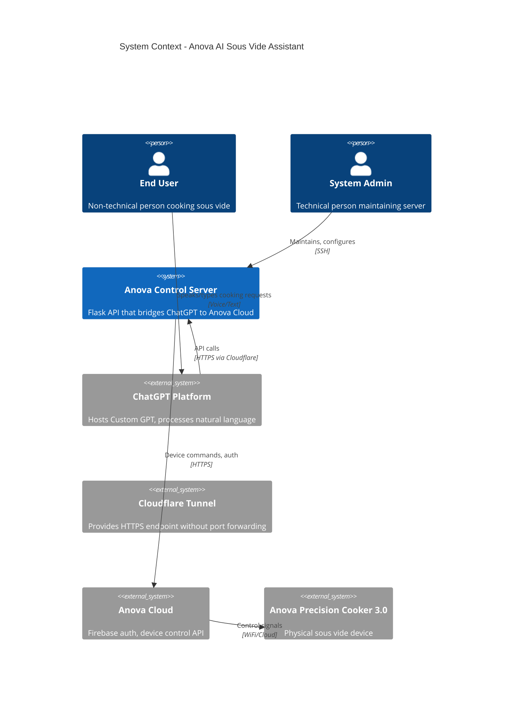

# 01 - System Context

> **Document Type:** C4 Level 1 - System Context  
> **Status:** Draft  
> **Version:** 2.0 (Merged)  
> **Last Updated:** 2025-01-08  
> **Depends On:** None (foundational document)  
> **Blocks:** 02-Security Architecture, 03-Component Architecture, 05-API Specification

---

## 1. Executive Summary

The Anova AI Sous Vide Assistant is a **bridge system** that enables natural language control of an Anova Precision Cooker 3.0 through ChatGPT. The system consists of a lightweight Python API server that translates ChatGPT Custom GPT actions into Anova cloud API commands while enforcing food safety constraints.

### Key Characteristics

| Attribute | Value |
|-----------|-------|
| **Architecture Style** | API Gateway / Bridge Pattern |
| **Deployment Model** | Self-hosted (Raspberry Pi Zero 2 W) |
| **Primary Interface** | ChatGPT Custom GPT |
| **Backend** | Python Flask REST API |
| **External Dependencies** | Anova Cloud API, Cloudflare Tunnel |
| **Critical Constraint** | Zero recurring costs, food safety validation |

---

## 2. System Context Diagram (C4 Level 1)

### 2.1 ASCII Diagram

```
                                    ┌─────────────────────────────────────┐
                                    │         EXTERNAL SYSTEMS            │
                                    └─────────────────────────────────────┘

    ┌──────────────────┐     ┌──────────────────┐     ┌──────────────────┐
    │   ChatGPT        │     │   Anova Cloud    │     │   Cloudflare     │
    │   Platform       │     │   (Firebase)     │     │   Tunnel         │
    │                  │     │                  │     │                  │
    │  • Custom GPT    │     │  • Device API    │     │  • HTTPS Proxy   │
    │  • OpenAI API    │     │  • Auth (JWT)    │     │  • DNS           │
    │  • Actions       │     │  • WebSocket     │     │  • TLS Cert      │
    └────────┬─────────┘     └────────┬─────────┘     └────────┬─────────┘
             │                        │                        │
             │ HTTPS                  │ HTTPS                  │ Tunnel
             │ (Actions)              │ (API Calls)            │ Protocol
             │                        │                        │
             ▼                        ▼                        ▼
    ╔════════════════════════════════════════════════════════════════════╗
    ║                     ANOVA ASSISTANT SYSTEM                         ║
    ║                        [WE BUILD THIS]                             ║
    ║                                                                    ║
    ║   ┌────────────────────────────────────────────────────────────┐   ║
    ║   │                    Control Server                          │   ║
    ║   │                                                            │   ║
    ║   │  • Validates cooking parameters (food safety critical)     │   ║
    ║   │  • Translates API calls to Anova commands                  │   ║
    ║   │  • Manages authentication with Anova Cloud                 │   ║
    ║   │  • Reports device status                                   │   ║
    ║   │                                                            │   ║
    ║   │  Location: Raspberry Pi Zero 2 W (prod) / Dev machine      │   ║
    ║   │  Exposure: HTTPS via Cloudflare Tunnel only                │   ║
    ║   └────────────────────────────────────────────────────────────┘   ║
    ╚════════════════════════════════════════════════════════════════════╝
             │
             │ WiFi (via Anova Cloud)
             ▼
    ┌──────────────────┐          ┌──────────────────┐
    │  Anova Precision │          │      USER        │
    │  Cooker 3.0      │◄─────────┤                  │
    │                  │ Physical │  • ChatGPT App   │
    │  • WiFi Module   │ Cooking  │  • Anova App     │
    │  • Temperature   │          │  • Voice/Text    │
    │  • Timer         │          └──────────────────┘
    └──────────────────┘
```

### 2.2 Mermaid Diagram



---

## 3. Actors & Stakeholders

### 3.1 Primary Actors

| Actor ID | Actor | Role | Technical Skill | Interaction Method |
|----------|-------|------|-----------------|-------------------|
| ACT-01 | End User (Recipient) | Cook sous vide | Non-technical | ChatGPT app (voice/text), Anova app (notifications) |
| ACT-02 | System Admin (Gift Giver) | System maintainer | Developer-level | SSH, direct server access |

### 3.2 Actor Profiles

#### ACT-01: End User (Recipient)

**Description:** The recipient of this system as a gift. They want to cook sous vide using natural conversation rather than navigating the Anova app. They may have limited knowledge of sous vide cooking techniques.

**Assumptions:**
- Already has ChatGPT Plus subscription
- Has iPhone/Android with ChatGPT app installed
- Has Anova app installed and device paired
- Located in Switzerland (timezone: CET/CEST)
- Speaks English (primary interaction language)

**Success Criteria:**
- Can start cooking without touching Anova app
- Receives helpful guidance on temperatures and times
- Never receives unsafe cooking recommendations
- Gets clear feedback when something goes wrong

**Failure Tolerance:** Low. If system fails, user can fall back to Anova app or physical buttons.

#### ACT-02: System Admin (Gift Giver)

**Description:** The person building and maintaining this system. Has full access to server, credentials, and codebase.

**Assumptions:**
- Comfortable with Python, Flask, Linux
- Can SSH into Raspberry Pi remotely
- Has access to recipient's Anova credentials (with permission)
- Available for occasional troubleshooting

**Success Criteria:**
- System runs for months without intervention
- Can diagnose issues remotely via logs
- Can update system without physical access to Pi

**Failure Tolerance:** Medium. Expects occasional maintenance but minimal.

### 3.3 External Systems

| System ID | System | Owner | Purpose | Dependency Level |
|-----------|--------|-------|---------|------------------|
| EXT-01 | ChatGPT Platform | OpenAI | Natural language interface | Critical |
| EXT-02 | Anova Cloud | Anova/Electrolux | Device control API | Critical |
| EXT-03 | Cloudflare Tunnel | Cloudflare | Public HTTPS endpoint | Critical |
| EXT-04 | Firebase Auth | Google (via Anova) | Authentication | Critical |

---

## 4. Trust Boundaries

### 4.1 Trust Boundary Diagram

```
┌─────────────────────────────────────────────────────────────────────────────┐
│                           TRUST BOUNDARIES                                  │
└─────────────────────────────────────────────────────────────────────────────┘

    UNTRUSTED                PARTIALLY TRUSTED           FULLY TRUSTED
    ──────────────────────────────────────────────────────────────────────────

    ┌─────────────┐
    │  End User   │
    │   Input     │
    └──────┬──────┘
           │
           │ Natural language (could contain anything)
           ▼
    ════════════════════════════════════════════════════════════════════════
    │              TRUST BOUNDARY 1 (TB-01): User → ChatGPT                 │
    ════════════════════════════════════════════════════════════════════════
           │
           ▼
    ┌─────────────────────────────────────────────┐
    │              ChatGPT Platform               │
    │                                             │
    │  - Interprets user intent                   │
    │  - Applies GPT safety guidelines            │
    │  - Structures API requests                  │
    │  - CANNOT see Anova credentials             │
    │  - CANNOT bypass API validation             │
    └──────────────────┬──────────────────────────┘
                       │
                       │ Structured API calls (JSON)
                       │ Could still contain invalid values
                       ▼
    ════════════════════════════════════════════════════════════════════════
    │            TRUST BOUNDARY 2 (TB-02): ChatGPT → Server                 │
    ════════════════════════════════════════════════════════════════════════
                       │
                       ▼
    ┌─────────────────────────────────────────────┐
    │           Anova Control Server              │
    │           [FULLY TRUSTED ZONE]              │
    │                                             │
    │  - Validates ALL inputs                     │
    │  - Enforces food safety rules               │
    │  - Holds Anova credentials                  │
    │  - Manages authentication tokens            │
    │  - Logs all operations                      │
    └──────────────────┬──────────────────────────┘
                       │
                       │ Authenticated API calls
                       ▼
    ════════════════════════════════════════════════════════════════════════
    │            TRUST BOUNDARY 3 (TB-03): Server → Anova Cloud             │
    ════════════════════════════════════════════════════════════════════════
                       │
                       ▼
    ┌─────────────────────────────────────────────┐
    │              Anova Cloud                    │
    │              [TRUSTED API]                  │
    └─────────────────────────────────────────────┘
```

### 4.2 Trust Boundary Rules

| Boundary ID | Boundary | Rule | Enforcement |
|-------------|----------|------|-------------|
| TB-01 | User → ChatGPT | User input is untrusted | ChatGPT's built-in safety; our GPT instructions |
| TB-02 | ChatGPT → Server | API requests are partially trusted | Server validates ALL parameters; rejects unsafe values |
| TB-03 | Server → Anova | Server is trusted; Anova validates further | Credentials stored securely; HTTPS only |

### 4.3 Critical Security Invariants

| Invariant ID | Invariant | Rationale |
|--------------|-----------|-----------|
| SEC-INV-01 | Anova credentials (email/password) never leave the local server | Prevents account compromise |
| SEC-INV-02 | Credentials are never logged, even in debug mode | Prevents credential leakage via logs |
| SEC-INV-03 | ChatGPT never receives credentials or tokens | GPT is not trusted with secrets |
| SEC-INV-04 | All API inputs are validated server-side | ChatGPT could hallucinate or be prompt-injected |
| SEC-INV-05 | Food safety rules are enforced at server, not just GPT | Defense in depth |

---

## 5. System Boundaries

### 5.1 In Scope

| Scope ID | Capability | Description | Priority |
|----------|------------|-------------|----------|
| SCOPE-01 | Cook initiation | Start cooking with temperature and time parameters | P0 |
| SCOPE-02 | Cook monitoring | Query current status (temp, time remaining, state) | P0 |
| SCOPE-03 | Cook termination | Stop active cooking session | P0 |
| SCOPE-04 | Natural language interface | Conversational interaction via ChatGPT | P0 |
| SCOPE-05 | Food safety validation | Temperature/time validation per food type | P0 |
| SCOPE-06 | Food safety guidance | Temperature/time recommendations per food type | P1 |

### 5.2 Out of Scope (Phase 1)

| OOS ID | Capability | Rationale | Alternative |
|--------|------------|-----------|-------------|
| OOS-01 | Recipe database | Future enhancement, not MVP | GPT's built-in knowledge |
| OOS-02 | Multi-device support | Single device simplifies initial deployment | Future enhancement |
| OOS-03 | Custom notifications | Complexity vs. value tradeoff | Anova app provides this natively |
| OOS-04 | Scheduling/delayed start | Food safety issues with delayed start | Not implemented |
| OOS-05 | Analytics/history | Privacy concern; not required for core | Not implemented |
| OOS-06 | Real-time streaming | Adds complexity; polling sufficient | Polling on status requests |

---

## 6. Functional Requirements

### 6.1 Core Functions

| Req ID | Requirement | Priority | Acceptance Criteria |
|--------|-------------|----------|---------------------|
| FR-01 | System SHALL start a cooking session with specified temperature and duration | Must | Given valid parameters, when start-cook is called, then device begins heating within 30 seconds |
| FR-02 | System SHALL report current cooking status | Must | Given an active session, when status is queried, then response includes current_temp, target_temp, time_remaining, state |
| FR-03 | System SHALL stop an active cooking session | Must | Given an active session, when stop-cook is called, then device stops heating within 10 seconds |
| FR-04 | System SHALL validate temperature is within safe range (40-100°C) | Must | Given temperature outside range, when start-cook is called, then request is rejected with error |
| FR-05 | System SHALL validate time is positive integer (1-5999 minutes) | Must | Given invalid time, when start-cook is called, then request is rejected with error |
| FR-06 | System SHALL return device offline status when device unreachable | Must | Given device offline, when any command is sent, then response indicates offline state |
| FR-07 | System SHALL reject unsafe poultry temperatures (<57°C) | Must | Given poultry food_type and temp < 57°C, then request is rejected with safety explanation |
| FR-08 | System SHALL reject unsafe ground meat temperatures (<60°C) | Must | Given ground meat food_type and temp < 60°C, then request is rejected with safety explanation |

### 6.2 ChatGPT Integration Functions

| Req ID | Requirement | Priority | Acceptance Criteria |
|--------|-------------|----------|---------------------|
| FR-10 | Custom GPT SHALL interpret natural language cooking requests | Must | Given "cook chicken breast", GPT extracts food_type=chicken, suggests temp=65°C, time=90min |
| FR-11 | Custom GPT SHALL confirm before starting cook | Should | Given a cook request, GPT presents parameters and asks for confirmation before calling API |
| FR-12 | Custom GPT SHALL provide food safety guidance | Must | Given unsafe parameters requested, GPT warns user and suggests safe alternatives |
| FR-13 | Custom GPT SHALL handle ambiguous requests with clarifying questions | Should | Given "cook steak", GPT asks about thickness and desired doneness |

---

## 7. Quality Requirements

### 7.1 Performance

| Req ID | Requirement | Target | Measurement Method |
|--------|-------------|--------|-------------------|
| QR-01 | API response time (p50) | < 1 second | Load test with 10 concurrent requests |
| QR-02 | API response time (p95) | < 2 seconds | Load test with 10 concurrent requests |
| QR-03 | API response time (p99) | < 5 seconds | Load test with 10 concurrent requests |
| QR-04 | End-to-end latency (ChatGPT → Device) | < 5 seconds | Timestamp comparison: GPT action → device state change |
| QR-05 | Server memory usage | < 128 MB | Monitor via `ps` or `/proc` during operation |
| QR-06 | Server CPU usage (idle) | < 5% | Monitor over 1-hour idle period |

### 7.2 Reliability

| Req ID | Requirement | Target | Measurement Method |
|--------|-------------|--------|-------------------|
| QR-10 | System uptime | 99% monthly | Uptime monitoring (UptimeRobot) |
| QR-11 | Auto-recovery from crash | < 60 seconds | Kill process, measure restart time via systemd |
| QR-12 | Auto-recovery from power cycle | < 120 seconds | Power cycle Pi, measure time to first successful API call |
| QR-13 | Graceful handling of Anova Cloud outage | No crash | Disconnect network, verify error response (not crash) |

### 7.3 Maintainability

| Req ID | Requirement | Target | Measurement Method |
|--------|-------------|--------|-------------------|
| QR-20 | Zero-touch operation | 3+ months | Track manual interventions required |
| QR-21 | Log rotation | Logs < 100 MB total | Check log directory size after 30 days |
| QR-22 | Remote administration | All admin via SSH | Verify no physical access required for maintenance |

### 7.4 Security

| Req ID | Requirement | Target | Measurement Method |
|--------|-------------|--------|-------------------|
| QR-30 | Credentials isolation | Credentials never in API responses | Code review + API response inspection |
| QR-31 | HTTPS only | All external traffic encrypted | Network capture analysis |
| QR-32 | Input validation | No injection vulnerabilities | Fuzz testing on all endpoints |
| QR-33 | API key authentication | All endpoints except /health require API key | Test unauthorized access |

---

## 8. Constraints

### 8.1 Technical Constraints

| Constraint ID | Constraint | Rationale |
|---------------|------------|-----------|
| TC-01 | Must run on Raspberry Pi Zero 2 W | Cost and power efficiency requirement |
| TC-02 | Must use Anova's official/documented API | Stability and supportability |
| TC-03 | Must work with existing ChatGPT Plus subscription | No additional subscription cost for user |
| TC-04 | Must use Cloudflare Tunnel (free tier) | Zero recurring cost requirement |
| TC-05 | ChatGPT action timeout ~30 seconds | OpenAI platform limitation |

### 8.2 Business Constraints

| Constraint ID | Constraint | Rationale |
|---------------|------------|-----------|
| BC-01 | Total hardware cost < $50 | Gift budget constraint |
| BC-02 | Recurring cost < $5/year | Sustainability requirement |
| BC-03 | Setup time for recipient < 10 minutes | User experience requirement |
| BC-04 | Maintenance frequency < quarterly | Practical for remote support |

---

## 9. Assumptions

| Assumption ID | Assumption | Impact if Invalid | Mitigation |
|---------------|------------|-------------------|------------|
| AS-01 | Anova Cloud API remains available and stable | System becomes non-functional | Fallback to direct device control; monitor announcements |
| AS-02 | ChatGPT Custom GPT Actions feature remains available | Need alternative interface | Design API to be platform-agnostic |
| AS-03 | Recipient has reliable home WiFi | Device cannot connect | Document troubleshooting |
| AS-04 | Recipient has active ChatGPT Plus subscription | Cannot use Custom GPT | User renews subscription |
| AS-05 | Firebase Auth flow remains unchanged | Authentication breaks | Monitor Anova updates; update client |
| AS-06 | pyanova-api library compatible with Precision Cooker 3.0 | May need custom implementation | Test during Phase 1 |

---

## 10. Risks

| Risk ID | Risk | Probability | Impact | Mitigation |
|---------|------|-------------|--------|------------|
| RS-01 | Anova API changes/deprecation | Medium | High | Monitor announcements; design for abstraction |
| RS-02 | ChatGPT Actions latency too high | Low | Medium | Optimize API response time; set user expectations |
| RS-03 | Food safety incident | Low | Critical | Conservative defaults; clear warnings; server-side validation |
| RS-04 | Pi hardware failure | Low | Medium | Document rebuild procedure; SD card backup |
| RS-05 | Cloudflare service changes | Low | Medium | Alternative: ngrok, tailscale |
| RS-06 | Credential compromise | Low | High | Encrypted storage; incident response plan |

---

## 11. External System Details

### 11.1 ChatGPT Platform (EXT-01)

**Interface Type:** Custom GPT with Actions (OpenAPI-defined)

**Data Exchanged:**
- **Inbound to ChatGPT:** User's natural language requests
- **Outbound from ChatGPT:** Structured API calls to our server

**Constraints:**
- Action timeout: ~30 seconds (design for this limit)
- Rate limits: Unknown; likely generous for single-user
- Custom GPT sharing: Via link (no approval needed)

**Failure Impact:**

| Failure Mode | User Experience | Mitigation |
|--------------|-----------------|------------|
| ChatGPT down | Cannot use voice/text interface | Use Anova app directly |
| Action timeout | "Something went wrong" message | Design all operations < 30s |
| GPT misconfigured | Wrong commands or no response | Admin fixes GPT config |

### 11.2 Anova Cloud (EXT-02)

**Interface Type:** REST API + WebSocket

**Data Exchanged:**
- **Outbound to Anova:** Start/stop commands, temp/time settings
- **Inbound from Anova:** Device status, current temp, timer state

**Constraints:**
- Requires valid Anova account credentials
- Firebase JWT authentication
- Rate limits: Unknown (design conservatively)
- Device must be online and connected to WiFi

**Failure Impact:**

| Failure Mode | User Experience | Mitigation |
|--------------|-----------------|------------|
| Anova Cloud down | Cannot control device remotely | Use physical buttons on device |
| Device offline | Commands fail | Return clear error; suggest checking WiFi |
| Auth token expired | Commands fail with 401 | Auto-refresh tokens |
| API rate limited | Commands fail with 429 | Implement backoff; cache status |

### 11.3 Cloudflare Tunnel (EXT-03)

**Interface Type:** Outbound tunnel from server to Cloudflare edge

**Constraints:**
- Requires `cloudflared` daemon running on server
- Free tier sufficient for this use case
- Auto-generated URL or custom domain

**Failure Impact:**

| Failure Mode | User Experience | Mitigation |
|--------------|-----------------|------------|
| Tunnel daemon crashes | ChatGPT cannot reach server | systemd auto-restart |
| Cloudflare outage | ChatGPT cannot reach server | Extremely rare; wait |
| DNS issues | Intermittent connectivity | Use Cloudflare's auto-URL |

---

## 12. Deployment Environments

| Environment | Hardware | Network | Purpose | Duration |
|-------------|----------|---------|---------|----------|
| **Development** | Developer's machine | ngrok tunnel | Build and test | Phase 1 (1 weekend) |
| **Production** | Raspberry Pi Zero 2 W | Cloudflare Tunnel | 24/7 operation | Phase 2+ (permanent) |

### 12.1 Production Hardware Specifications

- **Model:** Raspberry Pi Zero 2 W
- **CPU:** 1 GHz quad-core ARM Cortex-A53
- **RAM:** 512 MB
- **Storage:** 16GB+ MicroSD
- **Network:** WiFi 802.11 b/g/n
- **Power:** 5V/2.5A USB

---

## 13. Success Criteria

### 13.1 Phase 1 (Development) Success Criteria

| Criterion ID | Criterion | Verification Method |
|--------------|-----------|---------------------|
| SC-P1-01 | Can start cooking via ChatGPT with temperature and time | Manual test |
| SC-P1-02 | Can check cooking status via ChatGPT | Manual test |
| SC-P1-03 | Can stop cooking via ChatGPT | Manual test |
| SC-P1-04 | Invalid temperatures (< 40°C or > 100°C) are rejected | Automated test |
| SC-P1-05 | Unsafe poultry temps (< 57°C) are rejected | Automated test |
| SC-P1-06 | Device offline state returns helpful error | Unplug device; test |
| SC-P1-07 | Full round-trip completes within 30 seconds | Timing test |

### 13.2 Phase 2 (Production) Success Criteria

| Criterion ID | Criterion | Verification Method |
|--------------|-----------|---------------------|
| SC-P2-01 | Server runs 24/7 on Raspberry Pi | Uptime monitoring |
| SC-P2-02 | Auto-restarts after power cycle | Pull power; verify restart |
| SC-P2-03 | Fixed HTTPS URL accessible from internet | External test |
| SC-P2-04 | Recipient successfully completes one cook cycle | User report |

### 13.3 Long-Term Success Criteria

| Criterion ID | Criterion | Verification Method |
|--------------|-----------|---------------------|
| SC-LT-01 | Zero maintenance required for 3+ months | Admin observation |
| SC-LT-02 | Recipient uses system multiple times per week | User feedback |
| SC-LT-03 | No food safety incidents | User feedback |

---

## 14. Glossary

| Term | Definition |
|------|------------|
| **Custom GPT** | OpenAI's feature allowing creation of specialized ChatGPT assistants with custom instructions and API actions |
| **Actions** | Custom GPT capability to call external APIs defined via OpenAPI schema |
| **Sous Vide** | Cooking method using precise temperature-controlled water bath |
| **Cloudflare Tunnel** | Service that exposes local servers to internet via Cloudflare's network |
| **Firebase Auth** | Google's authentication service used by Anova for user authentication |
| **JWT** | JSON Web Token; authentication token format |
| **Danger Zone** | Temperature range 4°C-60°C where bacteria multiply rapidly |
| **Pasteurization** | Reducing pathogens to safe levels through time at temperature |

---

## 15. Document References

| Document | Purpose |
|----------|---------|
| 02-Security-Architecture | Credential flow, threat model, authentication |
| 03-Component-Architecture | Internal component structure and responsibilities |
| 05-API-Specification | OpenAPI specification for all endpoints |
| kb-domain-knowledge.md | Food safety rules and cooking parameters |

---

## 16. Document History

| Version | Date | Author | Changes |
|---------|------|--------|---------|
| 1.0 | 2025-01-08 | Claude | Initial draft |
| 2.0 | 2025-01-08 | Claude | Merged with previous iteration; added requirement IDs, trust boundaries |

---

## 17. Open Questions

| Question ID | Question | Blocking | Owner | Status |
|-------------|----------|----------|-------|--------|
| OQ-01 | What is the Anova API authentication flow exactly? | 02-Security Architecture | Research | Open |
| OQ-02 | Is `pyanova-api` compatible with Precision Cooker 3.0? | Implementation | Research | Open |
| OQ-03 | What are Anova Cloud rate limits? | 05-API Specification | Research | Open |
| OQ-04 | Exact ChatGPT action timeout? | 05-API Specification | Test | Open |
| OQ-05 | Firebase token lifetime? | 02-Security Architecture | Research | Open |
